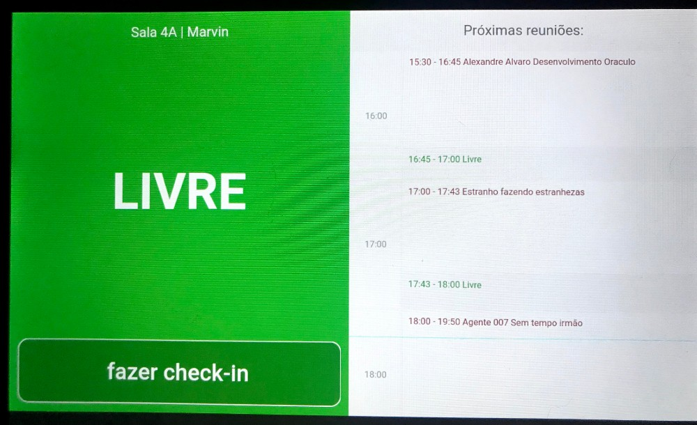

# Oraculo - Meeting Room Scheduling

Oraculo is a flutter application that visualizes meeting room availability. It works using Microsoft Graph API with Oauth2.0 to get the room list and schedule information.

# Preliminary Image

# Licence
Oraculo is licensed under the open source MIT License.
You can use for private or commercial pourposes, modify, distribute, etc.
A short and simple permissive license with conditions only requiring preservation of copyright and license notices.

# Why Oraculo?

The name is a Brazilian Portuguese translation and was inspired by DC comics character: Oracle (a.k.a. Barbara Gordon, the former Batgirl).
The graphic novel Batman: The Killing Joke depicts the Joker shooting her through the spinal cord in her civilian identity, resulting in paraplegia. In subsequent stories, Batgirl was reestablished as Oracle, a technical advisor, computer expert and information broker. Providing intelligence and computer hacking services to assist other superheroes, she doing a fundamental role to saving the day as a team.

# Are you a native english speaker?
No, I am not. If you find typos, grammar errors or whatever please feel free to PR or tell me.